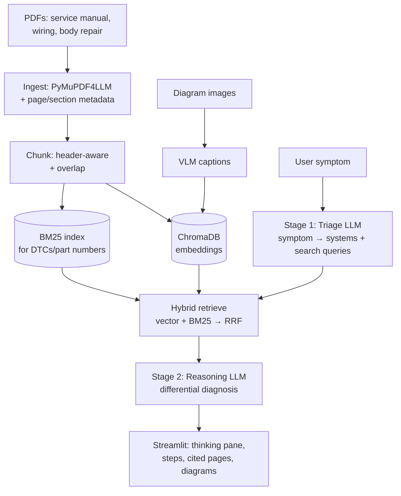

# Document Query Application for Vehicle Owner's Manuals

A Streamlit-based web application that allows vehicle owners and fleet managers to upload owner's manuals in multiple formats (PDF, images, Excel, PowerPoint, video) and query them using natural language questions. Get instant answers like "What's the recommended tire pressure?" instead of manually searching through 200-page manuals.

## Table of Contents

- [Quick Start](#quick-start)
- [Project Structure](#project-structure)
- [Installation](#installation)
- [Configuration](#configuration)
- [Running the Application](#running-the-application)
- [Testing](#testing)
- [Architecture Overview](#architecture-overview)
- [Documentation](#documentation)
- [Development Workflow](#development-workflow)
- [Known Limitations](#known-limitations)
- [Contributing](#contributing)
- [License](#license)

---

## Quick Start

### Prerequisites
- **Python 3.9+**
- **OpenAI API Key** (required for LLM and embeddings)
- **pip** or **conda** for dependency management

### Get Running in 5 Minutes

1. **Clone the repository** (or extract if provided as archive)
   ```bash
   cd "know my car- owner's manual"
   ```

2. **Create a virtual environment**
   ```bash
   python -m venv venv
   source venv/bin/activate  # On Windows: venv\Scripts\activate
   ```

3. **Install dependencies**
   ```bash
   pip install -r requirements.txt
   ```

4. **Set up your OpenAI API key**
   ```bash
   # Create .streamlit/secrets.toml
   mkdir -p .streamlit
   echo 'OPENAI_API_KEY = "sk-your-api-key-here"' > .streamlit/secrets.toml
   ```

5. **Run the Streamlit app**
   ```bash
   streamlit run app.py
   ```
   Opens in browser at `http://localhost:8501`

6. **Upload a manual and ask a question!**

---

## Project Structure

```
know my car- owner's manual/
├── app.py                          # Main Streamlit application entry point
├── requirements.txt                # Python dependencies
├── README.md                       # This file
├── agent.md                        # VS Code agent customization
│
├── src/                            # Application source code
│   ├── __init__.py
│   ├── components/                 # Core application components
│   │   ├── __init__.py
│   │   ├── document_parser.py      # Multi-format file parsing (PDF, images, Excel, etc.)
│   │   ├── embedding_generator.py  # OpenAI embeddings + caching
│   │   ├── semantic_indexer.py     # FAISS in-memory vector indexing
│   │   ├── query_processor.py      # Semantic search + retrieval
│   │   ├── answer_generator.py     # LLM answer generation
│   │   ├── session_manager.py      # Session state lifecycle
│   │   └── error_handler.py        # Error logging & user messages
│   │
│   ├── pages/                      # Streamlit multi-page app pages
│   │   ├── __init__.py
│   │   ├── 1_Upload.py             # File upload page
│   │   ├── 2_Query.py              # Query / answer page
│   │   └── 3_Session.py            # Session management (clear, docs list)
│   │
│   └── utils/                      # Utilities
│       ├── __init__.py
│       ├── logger.py               # Logging setup
│       ├── validators.py           # Input validation
│       └── constants.py            # Constants (timeouts, limits, etc.)
│
├── tests/                          # Component-level and integration tests
│   ├── __init__.py
│   ├── conftest.py                 # pytest fixtures
│   ├── test_document_parser.py     # CT-01: File parsing tests
│   ├── test_embedding_generator.py # CT-02: Embedding tests
│   ├── test_semantic_indexer.py    # CT-02: FAISS indexing tests
│   ├── test_query_processor.py     # CT-03: Query processing tests
│   ├── test_answer_generator.py    # CT-03: LLM answer tests
│   ├── test_session_manager.py     # CT-04: Session management tests
│   ├── test_error_handler.py       # CT-05: Error handling tests
│   └── test_performance.py         # CT-06: Performance/NFR tests
│
├── docs/                           # Documentation
│   ├── SRS.md                      # Software Requirements Specification
│   ├── ACCEPTANCE_TESTS.md         # Acceptance test scenarios (AT-01 to AT-06)
│   │
│   └── design/                     # Software Design Document & artifacts
│       ├── SDD.html                # Self-contained HTML design doc (open in browser)
│       ├── openapi.yaml            # API specification
│       ├── schema.sql              # Logical database schema (reference for v2)
│       ├── Component-Tests.md      # Component-level test specifications (CT-01 to CT-06)
│       │
│       └── adr/                    # Architecture Decision Records
│           ├── 0001-use-streamlit-framework.md
│           ├── 0002-langchain-openai-api.md
│           ├── 0003-faiss-vector-indexing.md
│           ├── 0004-session-only-storage.md
│           ├── 0005-openai-embeddings.md
│           ├── 0006-multi-format-parsing.md
│           └── 0007-streamlit-caching.md
│
├── .streamlit/                     # Streamlit configuration
│   ├── config.toml                 # App configuration (theme, layout, etc.)
│   └── secrets.toml                # Secrets (OpenAI API key) — NOT IN GIT
│
├── .gitignore                      # Git ignore patterns
└── Dockerfile                      # Docker build file (for deployment)
```

---

## Installation

### Development Environment Setup

1. **Python Version**
   ```bash
   python --version  # Ensure 3.9 or later
   ```

2. **Virtual Environment** (recommended)
   ```bash
   python -m venv venv
   source venv/bin/activate  # Linux/Mac
   # OR
   venv\Scripts\activate  # Windows
   ```

3. **Install Dependencies**
   ```bash
   pip install -r requirements.txt
   ```

4. **Verify Installation**
   ```bash
   python -c "import streamlit, langchain, faiss; print('All dependencies installed!')"
   ```

### Dependencies

See `requirements.txt` for full list. Key packages:

- **Web Framework**: `streamlit >=1.28.0`
- **LLM Integration**: `langchain`, `openai`
- **Vector Search**: `faiss-cpu` (or `faiss-gpu` for GPU)
- **Document Parsing**: `PyPDF2`, `pdfplumber`, `easyocr`, `pandas`, `python-pptx`, `moviepy`
- **Embeddings**: Included via OpenAI API (no local model needed)
- **Testing**: `pytest`, `pytest-mock`

---

## Configuration

### OpenAI API Key

**Required** to run the application. Two ways to provide it:

#### Option 1: Streamlit Secrets (Recommended for Development)
```bash
mkdir -p .streamlit
cat > .streamlit/secrets.toml << 'EOF'
OPENAI_API_KEY = "sk-your-api-key-here"
EOF
chmod 600 .streamlit/secrets.toml  # Restrict permissions
```

#### Option 2: Environment Variable
```bash
export OPENAI_API_KEY="sk-your-api-key-here"
streamlit run app.py
```

#### Option 3: Streamlit Cloud Secrets
Set the `OPENAI_API_KEY` in your Streamlit Cloud project settings (Secrets tab).

### Application Configuration

Edit `.streamlit/config.toml` to customize:

```toml
[theme]
primaryColor = "#0066cc"
backgroundColor = "#ffffff"
secondaryBackgroundColor = "#f0f2f6"

[client]
maxUploadSize = 50  # MB

[logger]
level = "info"
```

### Environment Variables

| Variable | Required | Default | Purpose |
|----------|----------|---------|---------|
| `OPENAI_API_KEY` | Yes | — | OpenAI API key for embeddings and LLM |
| `OPENAI_MODEL` | No | `gpt-3.5-turbo` | LLM model (gpt-4 for higher quality) |
| `EMBEDDING_MODEL` | No | `text-embedding-3-small` | Embedding model |
| `QUERY_TIMEOUT_SECONDS` | No | 30 | Timeout for query processing |
| `SESSION_TIMEOUT_MINUTES` | No | 60 | Session inactivity timeout |
| `LOG_LEVEL` | No | `INFO` | Logging level (DEBUG, INFO, WARNING, ERROR) |
| `MAX_DOCS_PER_SESSION` | No | 10 | Max documents to upload per session |
| `MAX_FILE_SIZE_MB` | No | 50 | Max file size for uploads |

---

## Running the Application

### Development Mode

```bash
# Start the Streamlit dev server
streamlit run app.py

# Opens browser at http://localhost:8501
# Auto-reloads on file changes
```

### Production Mode (Docker)

```bash
# Build Docker image
docker build -t document-query-app:latest .

# Run container
docker run -e OPENAI_API_KEY="sk-..." -p 8501:8501 document-query-app:latest

# Opens at http://localhost:8501
```

### Streamlit Cloud Deployment

1. Push code to GitHub
2. Go to https://share.streamlit.io
3. Click "New app"
4. Select your repository and `app.py`
5. Add `OPENAI_API_KEY` in Secrets
6. Deploy!

---

## Testing

### Run All Tests

```bash
pytest tests/ -v
```

### Run Specific Test Category

```bash
pytest tests/test_document_parser.py -v     # File parsing tests (CT-01)
pytest tests/test_embedding_generator.py -v # Embedding tests (CT-02)
pytest tests/test_query_processor.py -v     # Query tests (CT-03)
pytest tests/test_session_manager.py -v     # Session tests (CT-04)
pytest tests/test_error_handler.py -v       # Error handling tests (CT-05)
pytest tests/test_performance.py -v         # Performance tests (CT-06)
```

### Coverage Report

```bash
pytest tests/ --cov=src --cov-report=html
open htmlcov/index.html  # View report
```

### Acceptance Tests

Acceptance tests (AT-01 through AT-06 from [ACCEPTANCE_TESTS.md](docs/ACCEPTANCE_TESTS.md)) are manual end-to-end scenarios. To run:

1. Start the app: `streamlit run app.py`
2. Follow the steps in each acceptance test scenario
3. Verify the expected behavior

Example: **AT-01.1 (Successfully Upload a PDF Manual)**
- Given: Valid PDF file available
- When: Click "Upload" and select PDF
- Then: Success message appears with filename

---

## Architecture Overview

### High-Level Design



### Key Design Decisions

| Decision | Choice | Why? |
|----------|--------|------|
| Framework | Streamlit | No frontend/backend split needed; built-in session management |
| LLM | OpenAI API | High quality; integrates via LangChain; can swap providers later |
| Vector Store | FAISS (in-memory) | Fast; session-only storage aligns with v1 scope |
| Storage | Session-only (no DB) | v1 requirement; v2 migration path documented |
| Parsing | Multi-library | Best-of-breed for each format (PyPDF2, EasyOCR, pandas, etc.) |
| Caching | @st.cache_data/resource | Minimize Streamlit rerun cost |

**See [docs/design/SDD.html](docs/design/SDD.html) for full architecture.**

### Components & Responsibilities

| Component | Single Responsibility | Tests (CT) |
|-----------|----------------------|-----------|
| DocumentParser | Extract text from files | CT-01 |
| EmbeddingGenerator | Generate vector embeddings | CT-02 |
| SemanticIndexer | Build & query FAISS index | CT-02 |
| QueryProcessor | Retrieve relevant passages | CT-03 |
| AnswerGenerator | Generate LLM answers | CT-03 |
| SessionManager | Manage session state lifecycle | CT-04 |
| ErrorHandler | Log errors & format user messages | CT-05 |

---

## Documentation

### Requirements & Acceptance Tests

- **[SRS.md](docs/SRS.md)** — Software Requirements Specification
  - Product vision, user needs, features, use cases
  - Functional & non-functional requirements
  - Scope and deferred features

- **[ACCEPTANCE_TESTS.md](docs/ACCEPTANCE_TESTS.md)** — End-to-end test scenarios
  - AT-01: File upload (PDFs, images, Excel, PowerPoint, video, errors)
  - AT-02: Querying documents (relevance, no results, out-of-scope, timeouts)
  - AT-03: Error handling
  - AT-04: Session management
  - AT-05: Performance (NFRs)
  - AT-06: Integration workflows

### Design & Architecture

- **[docs/design/SDD.html](docs/design/SDD.html)** — Software Design Document (open in browser)
  - Component diagrams, sequence diagrams, deployment diagram
  - Tech stack table with ADR links
  - API boundary (OpenAPI spec)
  - Data boundary (schema)
  - Internal design (responsibilities, coupling, functional core/shell)
  - Traceability matrix
  - Open questions & future considerations

- **[docs/design/adr/](docs/design/adr/)** — Architecture Decision Records
  - ADR-0001: Use Streamlit as the web framework
  - ADR-0002: Use LangChain + OpenAI API for NLP
  - ADR-0003: Use FAISS for vector indexing
  - ADR-0004: Use session-only temporary storage (no persistent DB)
  - ADR-0005: Use OpenAI embeddings
  - ADR-0006: Use multi-format file parsing libraries
  - ADR-0007: Use Streamlit caching decorators for performance

- **[docs/design/openapi.yaml](docs/design/openapi.yaml)** — API specification
  - Endpoints: upload, query, session management
  - Request/response schemas
  - Error codes

- **[docs/design/schema.sql](docs/design/schema.sql)** — Logical database schema
  - Reference for future persistent storage (v2)
  - Tables: sessions, documents, parsed_content, embeddings, queries, query_sources

- **[docs/design/Component-Tests.md](docs/design/Component-Tests.md)** — Component-level test specs
  - CT-01 through CT-06 detailed test plans
  - Implementation examples with pytest code
  - Performance baselines for NFRs

---

## Development Workflow

### Local Development Cycle

1. **Create a feature branch**
   ```bash
   git checkout -b feature/my-feature
   ```

2. **Implement changes** (see [agent.md](agent.md) for coding conventions)
   - Add feature code to `src/components/` or `src/pages/`
   - Add component-level tests to `tests/`

3. **Run tests**
   ```bash
   pytest tests/ -v
   ```

4. **Run the app locally**
   ```bash
   streamlit run app.py
   ```

5. **Test manually** against acceptance test scenarios

6. **Commit & push**
   ```bash
   git add .
   git commit -m "feat: add new feature"
   git push origin feature/my-feature
   ```

7. **Create a pull request** (link to relevant issue/acceptance test)

### Coding Standards

- **Language**: Python 3.9+
- **Style**: PEP 8 (use `black`, `isort`, `flake8`)
- **Type Hints**: Recommended for all functions
- **Docstrings**: Module, class, and function level
- **Tests**: Write component-level tests; cover happy path + error cases

### Common Tasks

#### Add Support for a New File Format

1. Add parser method to `src/components/document_parser.py`
   ```python
   @st.cache_data
   def parse_xyz(file_bytes: bytes) -> List[Passage]:
       """Extract text from .xyz files."""
       # Implementation
       return passages
   ```

2. Update `validate_file()` to accept `.xyz`

3. Add tests in `tests/test_document_parser.py`

4. Update `requirements.txt` with new dependencies

5. Test with sample `.xyz` file

#### Improve Query Performance

1. Profile current bottleneck: `pytest tests/test_performance.py -v`
2. Options:
   - Reduce embedding chunk size (faster FAISS search, less context)
   - Use cheaper/faster LLM (GPT-3.5-Turbo instead of GPT-4)
   - Add query caching (v2 with persistent DB)
3. Update [NFR-01](docs/SRS.md#6-non-functional-requirements) baseline

#### Debug a User Issue

1. Check logs: `tail -f ~/.streamlit_logs/` (or Docker logs)
2. Reproduce locally with same file/query
3. Add debug logging to relevant component
4. Write test case to prevent regression

---

## Known Limitations

### Version 1.0

- **No persistent storage**: Documents and queries are cleared when session ends
- **No multi-instance scaling**: Single Streamlit service (not load-balanced)
- **No user authentication**: All sessions are anonymous
- **Max 10 documents per session**: Due to in-memory FAISS limit (~50–100 MB)
- **Files ≤ 50 MB**: Upload size limit
- **English-only (default)**: OCR and LLM optimized for English
- **No video transcription**: Videos must have captions; speech-to-text requires additional API (optional)

### Future Improvements (v2+)

- ✅ User authentication & authorization
- ✅ Persistent document storage & query history
- ✅ Multi-user collaboration & document sharing
- ✅ Vector database migration (Pinecone, Weaviate, PostgreSQL+pgvector)
- ✅ Analytics & usage tracking
- ✅ Mobile app (iOS/Android)
- ✅ Fine-tuned LLM (automotive domain-specific)
- ✅ Batch query processing
- ✅ Multi-language support

---

## Contributing

Contributions are welcome! Please follow these guidelines:

1. **Read the Design Doc**: Understand the architecture ([SDD.html](docs/design/SDD.html))
2. **Link to Requirement**: Every change should trace to a use case or requirement (see [SRS.md](docs/SRS.md))
3. **Write Tests**: Add component-level tests for new features (see [Component-Tests.md](docs/design/Component-Tests.md))
4. **Follow Code Standards**: PEP 8, type hints, docstrings
5. **Test Manually**: Run acceptance tests relevant to your change
6. **Document**: Update README, design docs, or docstrings as needed

### Reporting Issues

- **Bug**: Describe steps to reproduce, expected vs. actual behavior
- **Enhancement**: Link to a deferred feature in [SRS § 7](docs/SRS.md#7-future-considerations-explicitly-deferred) or suggest a new requirement
- **Question**: Check [Open Questions & Future Considerations](docs/design/SDD.html#open-questions) in SDD

---

## License

[To be filled in with appropriate license — MIT, Apache 2.0, etc.]

---

## Support & Contact

- **Documentation**: See [docs/](docs/) folder
- **Issues**: GitHub Issues
- **Discussions**: GitHub Discussions (for questions, ideas)

---

## Quick Links

| Resource | Purpose |
|----------|---------|
| [SRS.md](docs/SRS.md) | Product requirements & acceptance tests |
| [SDD.html](docs/design/SDD.html) | Architecture & design (open in browser) |
| [ADRs](docs/design/adr/) | Reasoning behind key decisions |
| [agent.md](agent.md) | Coding conventions & project guidelines |
| [Component-Tests.md](docs/design/Component-Tests.md) | Component-level test specs & examples |

---

**Happy querying! 🚗📖✨**
