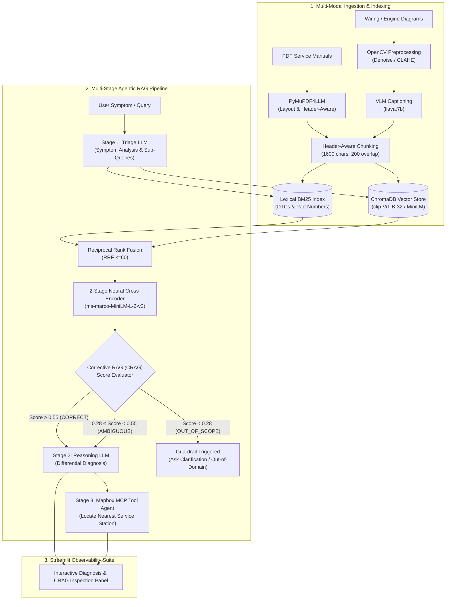

# 🚗 Agentic Diagnostic & Technical Manual RAG System

> **Advanced Production-Grade Multi-Modal Retrieval-Augmented Generation (RAG) Architecture featuring 2-Stage Neural Cross-Encoder Reranking, Corrective RAG (CRAG) Quality Control, Agentic Tool Execution via Model Context Protocol (MCP), and Layout-Aware Ingestion.**

[](https://www.python.org/downloads/)
[](https://streamlit.io/)
[](https://www.trychroma.com/)
[](tests/)
[](#-architecture--pipeline)

---

## 🌟 Technical Highlights & Architecture Overview

This project is a multi-modal, agentic RAG platform designed to parse, index, search, evaluate, and reason over complex domain manuals (vehicle owner manuals, diagnostic procedures, wiring diagrams, and parts documentation).

Instead of naive chunking and single-pass vector lookup, this system implements a **5-Layer Production RAG Pipeline**:

1. **Layout-Aware & Multi-Modal Ingestion**: Structure-preserving PDF markdown parsing via `PyMuPDF4LLM`, OpenCV image preprocessing (CLAHE/binarization), and Vision-Language Model (`llava:7b`) diagram captioning.
2. **Hybrid Multi-Query Sparse-Dense Retrieval**: Combines exact lexical matching (BM25 for Diagnostic Trouble Codes like `P0300`, part numbers) with dense semantic search (ChromaDB), fused via **Reciprocal Rank Fusion (RRF)** across LLM-generated multi-query variants.
3. **2-Stage Neural Cross-Encoder Reranking**: Evaluates joint query-passage attention $g([q; d])$ using `sentence-transformers/ms-marco-MiniLM-L-6-v2` with Sigmoid logit normalization and automotive domain heuristic boosting.
4. **Corrective RAG (CRAG) Quality Control & Filtering**: Evaluates neural confidence scores against calibrated thresholds to grade retrieval (`CORRECT`, `AMBIGUOUS`, `OUT_OF_SCOPE`) and dynamically filters noise chunks before LLM generation.
5. **Agentic Tool Execution (Model Context Protocol - MCP)**: Stage 3 Agent connects diagnostic conclusions to physical location recommendations via Mapbox MCP tools.

---

## 📐 End-to-End Pipeline Architecture



---

## 💡 Key Features & System Capabilities

### 1. 2-Stage Neural Cross-Encoder Reranking
- **Bi-Encoder Pre-Selection**: Retrieves candidate passages fast in $O(1)$ vector index lookup time.
- **Cross-Encoder Rescoring**: Feeds the top-$K$ candidates through a cross-attentional transformer to capture exact token interaction, computing scores via:
  $$\text{Score}(q, d) = \frac{1}{1 + e^{-\text{logit}(q, d)}}$$
- **Domain DTC Boost**: Applies targeted logit multipliers for diagnostic trouble codes (`P0300`, `P0420`, `P0171`), preventing retrieval loss on critical code references.

### 2. Corrective RAG (CRAG) Self-Correction
- **Dynamic Noise Filtering**: Removes irrelevant context chunks before passing to the generator, preventing LLM hallucination and context window dilution.
- **Confidence Classification**:
  - 🟢 `CORRECT` ($\text{score} \ge 0.55$): High precision context supplied directly to Reasoning LLM.
  - 🟡 `AMBIGUOUS` ($0.28 \le \text{score} < 0.55$): Partial confidence; signals context caution to the user.
  - 🔴 `OUT_OF_SCOPE` ($\text{score} < 0.28$): Safely halts diagnostic generation, protecting against ungrounded outputs.

### 3. Agentic Workflow & Tool Integration
- **Stage 1 Triage Agent**: Deconstructs user symptoms into primary systems and synthetic search variations.
- **Stage 2 Diagnostic Reasoning Agent**: Synthesizes differential diagnosis, root cause possibilities, and step-by-step resolution procedures.
- **Stage 3 Location MCP Agent**: Automatically queries Mapbox API via Model Context Protocol (MCP) to present nearby service centers, interactive coordinates, and distance metrics.

### 4. Rich UI Observability Panel
- Full visibility into internal RAG mechanics on the Streamlit dashboard:
  - Neural confidence score gauges
  - Retained vs. Filtered chunk breakdown
  - Per-passage relevance score inspection and source manual page tracing

---

## 🛠️ Tech Stack & Libraries

| Category | Component / Library | Purpose |
| :--- | :--- | :--- |
| **Web Framework** | Streamlit | Responsive dashboard with live streaming & observability panels |
| **Vector DB** | ChromaDB / FAISS | In-memory semantic vector indexing & similarity search |
| **Reranking** | `sentence-transformers` | Neural Cross-Encoder reranker (`ms-marco-MiniLM-L-6-v2`) |
| **Lexical Search** | `rank-bm25` | Sparse BM25 retrieval for DTCs and part numbers |
| **PDF Ingestion** | `pymupdf4llm`, `PyPDF2` | Structural markdown parsing with header awareness |
| **Image & OCR** | OpenCV, `easyocr`, `Pillow` | Binarization, CLAHE contrast enhancement, OCR |
| **LLM & Embeddings** | OpenAI API / Ollama / LangChain | Multi-stage agent reasoning and embedding generation |
| **Testing** | PyTest, PyTest-Mock | Automated unit testing & regression suite |

---

## 📁 Repository Structure

```
know-my-car--owner-s-manual-main/
├── app.py                            # Streamlit entry point (Upload, Query, Diagnose, Session)
├── requirements.txt                  # Python project dependencies
├── ExplanationOfRAGApp.md            # In-depth RAG concept guide & architectural textbook
├── Enhancement_CRAG_and_Reranking.md # Mathematical breakdown, resume points & interview Q&A
│
├── src/                              # Main application package
│   ├── components/                   # Modular pipeline components
│   │   ├── cross_encoder_reranker.py # 2-Stage Neural Cross-Encoder implementation
│   │   ├── crag_evaluator.py         # Corrective RAG evaluator & noise filter
│   │   ├── hybrid_retriever.py       # Hybrid BM25 + Vector retriever with RRF
│   │   ├── document_parser.py        # Multi-format document parser (PDF, OCR, VLM)
│   │   ├── query_processor.py        # Multi-query generator & search processor
│   │   ├── reasoning_llm.py          # Stage 1 Triage & Stage 2 Reasoning LLMs
│   │   ├── session_manager.py        # State lifecycle & session management
│   │   └── error_handler.py          # Error handling & logging
│   ├── models.py                     # Data models (Passage, QueryResult, CRAGReport)
│   └── utils/                        # System constants, secrets & logger helpers
│
└── tests/                            # Automated test suite
    ├── test_cross_encoder_reranker.py# Cross-Encoder test cases
    ├── test_crag_evaluator.py        # CRAG evaluation & threshold test cases
    ├── test_validators.py            # Input validation tests
    └── test_session_manager.py       # Session lifecycle tests
```

---

## 🚀 Quick Start Guide

### 1. Prerequisites & Virtual Environment Setup
Ensure Python 3.9+ is installed. Clone the repository and initialize the virtual environment:

```powershell
# Create virtual environment
python -m venv .venv

# Activate environment (Windows)
.\.venv\Scripts\activate

# Install dependencies (fast installation with uv or pip)
pip install -r requirements.txt
```

### 2. Configure Local Secrets
Create `.streamlit/secrets.toml` to configure models and keys:

```toml
OPENAI_MODEL = "qwen2.5:7b-instruct-q4_K_M"
EMBEDDING_MODEL = "sentence-transformers/clip-ViT-B-32"
CROSS_ENCODER_MODEL = "cross-encoder/ms-marco-MiniLM-L-6-v2"
LOG_LEVEL = "INFO"
```

### 3. Launch the Application
Start the Streamlit interface:

```powershell
streamlit run app.py
```
Access the application in your browser at `http://localhost:8501`.

---

## 🧪 Running Automated Unit Tests

Execute the comprehensive test suite using `pytest`:

```powershell
# Run CRAG & Cross-Encoder Reranker tests
.\.venv\Scripts\pytest.exe tests/test_cross_encoder_reranker.py tests/test_crag_evaluator.py -v

# Run full project test suite
.\.venv\Scripts\pytest.exe -v
```

**Test Coverage Highlights**:
- Joint token reranking and score normalization verification
- Exact DTC code boost validation (`P0300`, `P0420`)
- CRAG score evaluation against `CORRECT` ($\ge 0.55$) and `OUT_OF_SCOPE` ($< 0.28$) thresholds
- Edge-case handling for empty context and out-of-domain queries

---

## 📄 License
This project is open-source under the MIT License.
